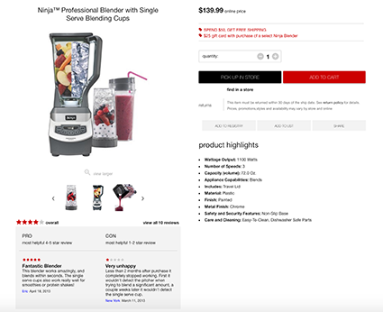
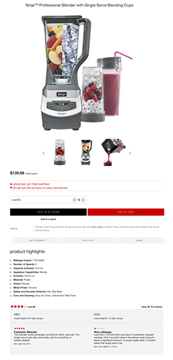
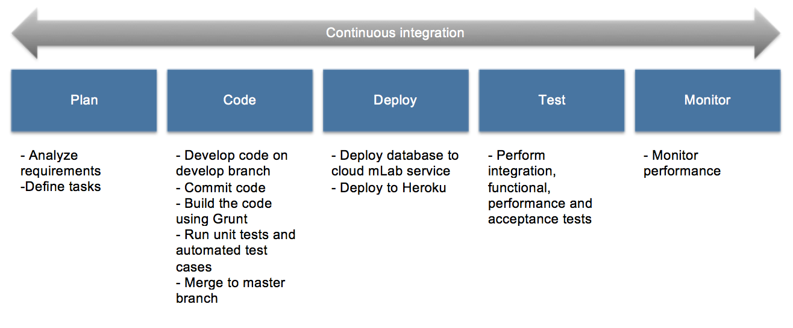

# myRetail - Programming Case Study – Browse/ Front Facing App (MEAN Stack)

## Application Overview
myRetail is a full-stack web responsive app that gets data from a MongoDB
Database and presents it on the user interface. Features a carousel to scroll through the product images.

## Application Features/Requirements

**1. Responsive Design**
- Requirement: Use the provided design docs, desktop.psd and mobile.psd, as general guidelines to create the user interface.

_Desktop_

_Mobile_

**2. Provided JSON file imported into MongoDB Collection**
- Requirement: Use the provided json file, item-data.json, to populate the title, images and price.

- The JSON file was imported into a MongoDB database. A server route to get the document was implemented.

**3. Full-stack implementation**
- Requirement: The client side code can be backbone, angular or another framework of your choice. React
(additional library’s such as Redux are welcome). Use node to run the application.

- The client side code was implemented in AngularJS and Angular Material.

**4. Add to Cart Button shown depending on purchasingChannelCode value**
- Requirement: Show the add to cart button only if the item is available online, purchasingChannelCode equals
0 or 1.

**5. Pick Up Button shown depending on purchasingChannelCode value**
- Requirement: Show the pick up in store only if the item is available instore, purchasingChannelCode equals 0
or 2.

**6. Carousel**
- Requirement: Create a carousel to scroll through the images

## Technologies
- MongoDB
- Express
- AngularJS
- Node.js
- Angular Material
- Grunt
- Heroku
- mLab
- Protractor

## Setup
1. Clone the repo to your computer using `git clone https://github.com/claudiacalderas/myRetail.git`
2. Run `npm install`
3. Run `grunt`
4. If running the app locally, ensure Mongo is running `mongod`
    In Robomongo:
      Create database: `targetcasestudy`
      Define collection: `catalog`
      Insert document and add content of `item-data.json`

    In Shell:
      `mongoimport -d targetcasestudy -c catalog item-data.json`
5. Start the server by running `npm start`

## Tests

The following test cases were created using Protractor. The spec file can be found at /test/myRetail-spec.js

- should have data to display on the DOM
- should display first three slides (carousel)
- should validate quantity not to be less than one
- should increase quantity when clicking on + icon and decrease when -
- should show both add to cart and pick up in store buttons when purchasingChannelCode is 0
- should show add to cart and hide pick up in store buttons when purchasingChannelCode is 1

To launch the application's tests, run:

    npm test

## Deployment

The app has been deployed to Heroku using database service mLab. It can be found [here](https://myretailapp.herokuapp.com)

The following approach was used:

